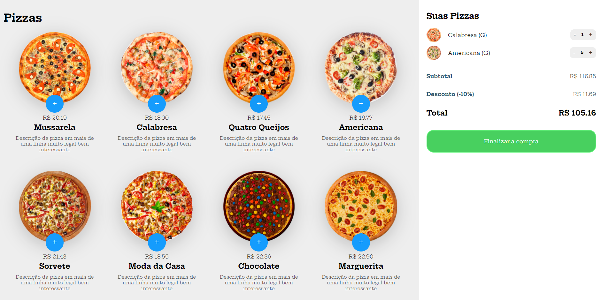

   <h1>Projeto Compra Pizza</h1>

 

Neste projeto, será criado página de compra de pizza, com a adição dos itens no carrinho em Javascript, HTML5, CSS3. Também será estruturado um layout, técnicas de CSS3 com containers e variáveis, como posicionar os elementos com Flexbox e Grid.

Também será aplicado uma Pipeline de integração continua com gitactions e gitpages.
  

 
### Conceitos aplicados no projeto

- Criação do clone da NETFLIX;
- Aplicação de conceitos em FLEXBOX;
- Estilização em HTML5 e CSS3;
- Conceitos de JavaScript;
- Subindo projeto para GitHub;
- Criando as páginas Inicial, Login e Página de usuários; 
- Aplicação de uma Pipeline DevOps com a aplicação do BUILD pelo TRAVIS e Deploy com Heroku. 

 

    <a href="https://wellington197.github.io/Compra-Pizzaria-JavaScript/" height="95px" width="440px">LINK PARA EXECUTAR PROJETO
    </a>

 

<h1>Tela inicial</h1>
  

<h1>Tela de apresentação dos filmes</h1>
  

<h1>Listagem dos filmes</h1>
  

<h1>Tela de login</h1>
  

<h1>Tela de usuários</h1>
  

### Atividades realizadas 

- [X] Criação da página inicial
- [X] Estilização via CSS3
- [X] Aplicação de posicionamento dos elementos
- [X] Criação de repositório no GitHub
- [X] Edição de um projeto
- [X] Criação e edição do Readme
- [X] Finalização do projeto
- [X] Criação da conta e configuração do Heroku
- [X] Edição 
- [X] Criação e edição do Readme
- [X] Finalização do projeto

## O que a plataforma é capaz de fazer :checkered_flag;

:trophy: Plataforma criada com conceito de responsividade. 
:trophy: Criação e adição de repositório no GitHub 
:trophy: Criação e edição do Readme 

## Como está andamento do projeto.

> Status do Projeto: Concluido :heavy_check_mark: 
> Status do Projeto: Em desenvolvimento :warning:

## Linguagens e libs utilizadas :books;
    * LINGUAGENS
        - HTML5
        - CSS3
        - JavaScript
        - Node Js

    * METODOLOGIA
        - Flexbox
        - RESPONSIVIDADE
        
    * FERRAMENTAS
        - GitHub
        - GitPages
        - Visual Stúdio
        - Travis

## Mentoria e Colaboração:

[<h5>Mentoria</h5>    Felipe Silva Aguiar](https://github.com/felipeAguiarCode) |[<h5>Dev</h5>     Francisco Wellington Costa ](https://github.com/wellington197) |[<h5>Plataforma</h5>     Digital Innovation One ](https://github.com/search?q=digitalinovation) 
| :---: | :---: | :---: |
